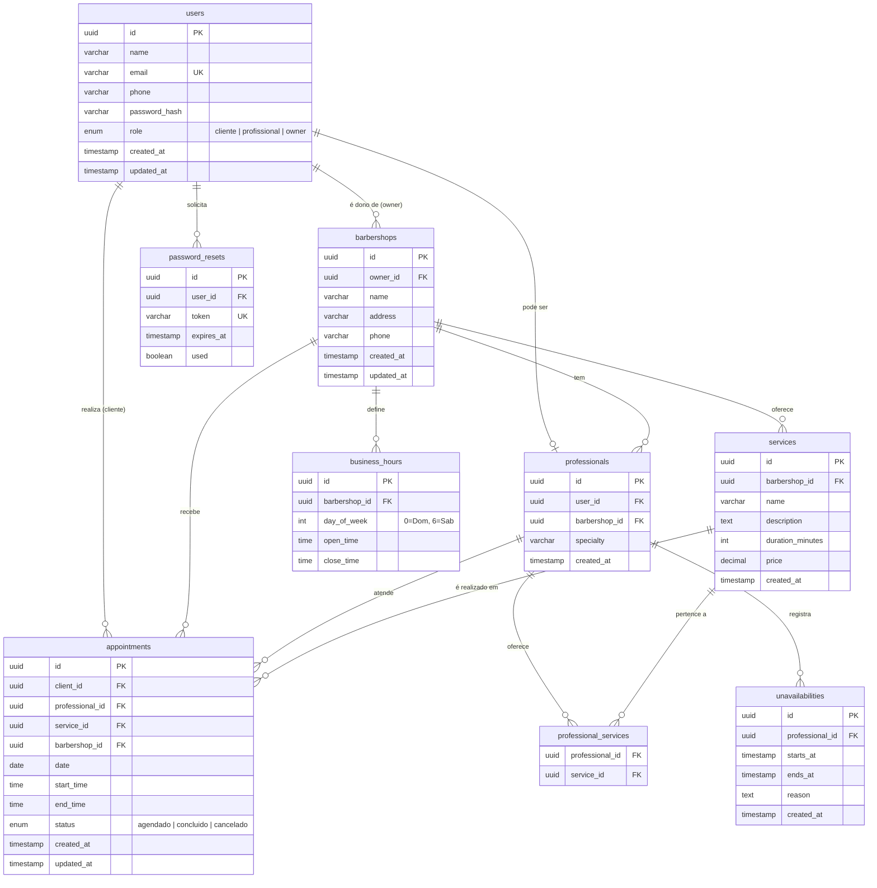

# Diagrama do Banco de Dados

> Atualizado para suportar múltiplas barbearias no mesmo sistema (decisão documentada na ADR-007).  
> Renderiza automaticamente no GitHub.

## Observações Importantes

### `users`
- `email` tem constraint `UNIQUE` em todo o sistema (RNF007)
- `password_hash` armazena o hash bcrypt — nunca a senha em texto puro (RNF001)
- `role` define o nível de acesso:
  - `cliente` — agenda em qualquer barbearia
  - `profissional` — vinculado a uma barbearia, gerencia própria agenda
  - `owner` — dono de uma barbearia, gerencia profissionais, serviços e horários

### `barbershops` — Barbearias
- Entidade central do sistema multi-tenant
- `owner_id` aponta para o `user` com `role = owner`
- Um owner pode ter mais de uma barbearia (relação 1-para-muitos)
- Serviços, horários de funcionamento e profissionais pertencem à barbearia

### `professionals`
- Todo profissional é também um `user` com `role = profissional`
- `barbershop_id` define a qual barbearia o profissional pertence
- Um profissional pertence a uma única barbearia no MVP

### `services`
- `barbershop_id` — cada barbearia define seu próprio catálogo de serviços
- `duration_minutes` é obrigatório — usado pelo motor de agendamento para calcular `end_time` (RF016)
- Um serviço pertence a uma única barbearia

### `professional_services`
- Relaciona quais serviços cada profissional oferece dentro da sua barbearia
- Apenas serviços da mesma barbearia podem ser associados ao profissional

### `business_hours`
- `barbershop_id` — cada barbearia define seu próprio horário de funcionamento (RF020)
- O owner configura e atualiza
- O motor de agendamento consulta esta tabela para validar horários

### `unavailabilities`
- Registra períodos em que um profissional não está disponível (RF024)
- O motor de agendamento bloqueia agendamentos nesse intervalo (RF025)

### `appointments`
- `barbershop_id` — registrado para facilitar consultas e relatórios por barbearia
- `end_time` é calculado como `start_time + duration_minutes` do serviço (RF016)
- `status`: `agendado`, `concluido` ou `cancelado` (RF029)
- Validação de conflito: verifica sobreposição de `[start_time, end_time]` para o mesmo `professional_id` e `date`

### `password_resets`
- Token de uso único com expiração (RF030)
- Campo `used` impede reuso do mesmo token
