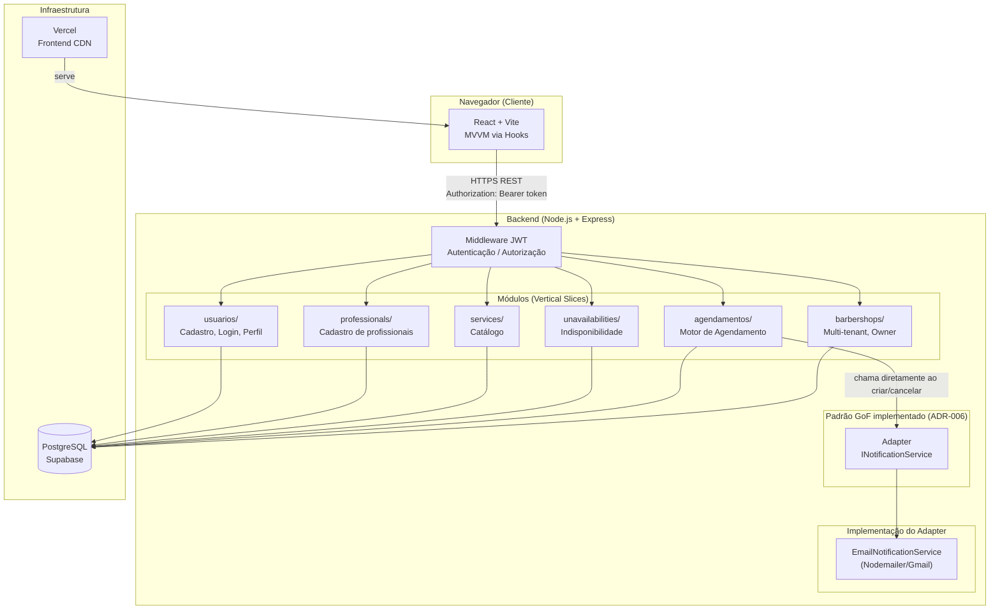
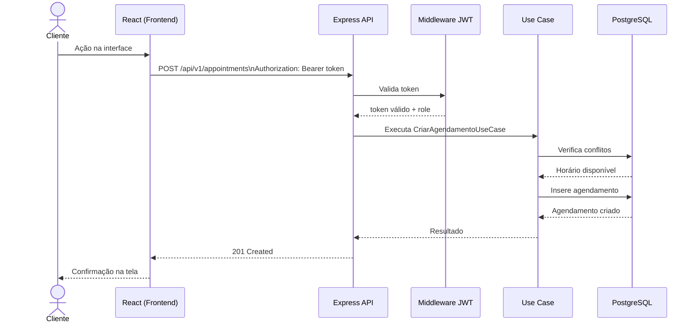

# Diagrama de Componentes

> Mostra como frontend, backend e banco de dados se comunicam no Barber Agenda.

## Fluxo de uma Requisição Autenticada

## Responsabilidades por Camada

| Camada | Responsabilidade | Tecnologia |
|--------|-----------------|-----------|
| Frontend | Apresentação, estado local, chamadas à API | React + TypeScript + Vite |
| Middleware | Validação do JWT em toda requisição protegida | jsonwebtoken |
| Módulos | Regras de negócio isoladas por domínio | Node.js + Express |
| Use Cases | Orquestração da lógica de negócio (Clean Architecture) | TypeScript |
| Repositórios | Acesso ao banco de dados | PostgreSQL via Supabase |
| Adapter | Envio de notificações desacoplado do provider | Padrão GoF (`INotificationService`) |

> Observer/Audit/Metrics descritos no ADR-006 não foram implementados — hoje existe só uma reação
> (notificação por e-mail) chamada diretamente pelo use case, sem necessidade do padrão ainda.
