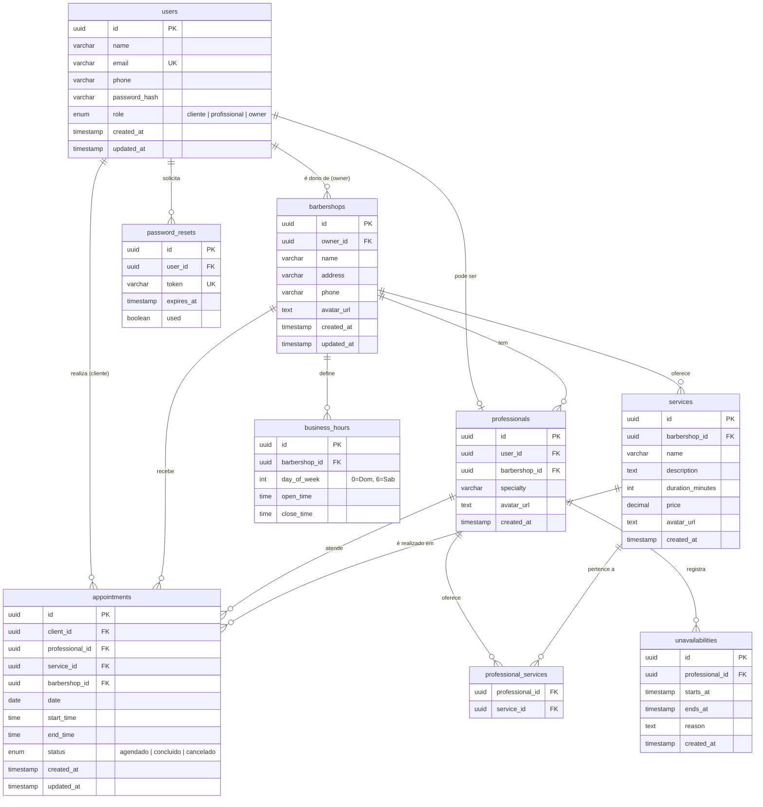

# Diagrama do Banco de Dados

> Atualizado para suportar múltiplas barbearias no mesmo sistema (decisão documentada na ADR-007).  
> Renderiza automaticamente no GitHub.

## Observações Importantes

### `users`
- `email` tem constraint `UNIQUE` em todo o sistema (RNF007)
- `password_hash` armazena o hash bcrypt — nunca a senha em texto puro (RNF001)
- `role` define o nível de acesso:
  - `cliente` — agenda em qualquer barbearia
  - `profissional` — vinculado a uma barbearia, gerencia própria agenda
  - `owner` — dono de uma barbearia, gerencia profissionais, serviços e horários

### `barbershops` — Barbearias
- Entidade central do sistema multi-tenant
- `owner_id` aponta para o `user` com `role = owner`
- Um owner pode ter mais de uma barbearia (relação 1-para-muitos)
- Serviços, horários de funcionamento e profissionais pertencem à barbearia
- `avatar_url` — URL pública da foto da barbearia, armazenada no Supabase Storage (bucket `avatars`)

### `professionals`
- Todo profissional é também um `user` com `role = profissional`
- `barbershop_id` define a qual barbearia o profissional pertence
- Um profissional pertence a uma única barbearia no MVP
- `avatar_url` — URL pública da foto do profissional, armazenada no Supabase Storage (bucket `avatars`)

### `services`
- `barbershop_id` — cada barbearia define seu próprio catálogo de serviços
- `duration_minutes` é obrigatório — usado pelo motor de agendamento para calcular `end_time` (RF016)
- Um serviço pertence a uma única barbearia
- `avatar_url` — URL pública da foto do serviço (opcional), armazenada no Supabase Storage (bucket `avatars`)

### `professional_services`
- Relaciona quais serviços cada profissional oferece dentro da sua barbearia
- Apenas serviços da mesma barbearia podem ser associados ao profissional

### `business_hours`
- `barbershop_id` — cada barbearia define seu próprio horário de funcionamento (RF020)
- O owner configura e atualiza
- O motor de agendamento consulta esta tabela para validar horários

### `unavailabilities`
- Registra períodos em que um profissional não está disponível (RF024)
- O motor de agendamento bloqueia agendamentos nesse intervalo (RF025)

### `appointments`
- `barbershop_id` — registrado para facilitar consultas e relatórios por barbearia
- `end_time` é calculado como `start_time + duration_minutes` do serviço (RF016)
- `status`: `agendado`, `concluido` ou `cancelado` (RF029)
- Validação de conflito: verifica sobreposição de `[start_time, end_time]` para o mesmo `professional_id` e `date`

### `password_resets`
- Token de uso único com expiração (RF030)
- Campo `used` impede reuso do mesmo token

## users — Usuários
| Campo | Descrição |
|-------|-----------|
| `id` | Identificador único do usuário (UUID). |
| `name` | Nome completo do usuário. |
| `email` | E-mail utilizado para login. Deve ser único no sistema. |
| `phone` | Telefone para contato. |
| `password_hash` | Senha criptografada utilizando algoritmo de hash. |
| `role` | Perfil do usuário (`cliente`, `profissional` ou `owner`). |
| `avatar_url` | URL pública da foto de perfil do usuário (armazenada no Supabase Storage). |
| `created_at` | Data de criação do cadastro. |
| `updated_at` | Data da última atualização do cadastro. |

## barbershops — Barbearias
| Campo | Descrição |
|-------|-----------|
| `id` | Identificador único da barbearia. |
| `owner_id` | Referência ao usuário proprietário da barbearia. |
| `name` | Nome da barbearia. |
| `address` | Endereço da barbearia. |
| `phone` | Telefone da barbearia. |
| `avatar_url` | URL pública da foto da barbearia (armazenada no Supabase Storage). |
| `created_at` | Data de criação do registro. |
| `updated_at` | Data da última atualização. |

## professionals — Profissionais
| Campo | Descrição |
|-------|-----------|
| `id` | Identificador único do profissional. |
| `user_id` | Referência ao usuário associado ao profissional. |
| `barbershop_id` | Barbearia onde o profissional atua. |
| `specialty` | Especialidade principal do profissional. |
| `avatar_url` | URL pública da foto do profissional (armazenada no Supabase Storage). |
| `created_at` | Data de criação do registro. |

## services — Serviços
| Campo | Descrição |
|-------|-----------|
| `id` | Identificador único do serviço. |
| `barbershop_id` | Barbearia que oferece o serviço. |
| `name` | Nome do serviço. |
| `description` | Descrição detalhada do serviço. |
| `duration_minutes` | Duração do serviço em minutos. |
| `price` | Valor cobrado pelo serviço. |
| `avatar_url` | URL pública da foto do serviço (armazenada no Supabase Storage). |
| `created_at` | Data de criação do serviço. |

## professional_services — Serviços dos Profissionais
| Campo | Descrição |
|-------|-----------|
| `professional_id` | Profissional que realiza o serviço. |
| `service_id` | Serviço oferecido pelo profissional. |

## business_hours — Horários de Funcionamento
| Campo | Descrição |
|-------|-----------|
| `id` | Identificador do horário de funcionamento. |
| `barbershop_id` | Barbearia associada. |
| `day_of_week` | Dia da semana (0 = Domingo até 6 = Sábado). |
| `open_time` | Horário de abertura. |
| `close_time` | Horário de fechamento. |

## unavailabilities — Indisponibilidades
| Campo | Descrição |
|-------|-----------|
| `id` | Identificador da indisponibilidade. |
| `professional_id` | Profissional indisponível. |
| `starts_at` | Data e hora de início da indisponibilidade. |
| `ends_at` | Data e hora de término da indisponibilidade. |
| `reason` | Motivo da indisponibilidade. |
| `created_at` | Data de criação do registro. |

## appointments — Agendamentos
| Campo | Descrição |
|-------|-----------|
| `id` | Identificador único do agendamento. |
| `client_id` | Cliente que realizou o agendamento. |
| `professional_id` | Profissional responsável pelo atendimento. |
| `service_id` | Serviço selecionado. |
| `barbershop_id` | Barbearia onde ocorrerá o atendimento. |
| `date` | Data do atendimento. |
| `start_time` | Horário de início do atendimento. |
| `end_time` | Horário de término do atendimento. |
| `status` | Situação do agendamento (`agendado`, `concluido`, `cancelado`). |
| `created_at` | Data de criação do agendamento. |
| `updated_at` | Data da última atualização. |

## password_resets — Recuperação de Senha
| Campo | Descrição |
|-------|-----------|
| `id` | Identificador da solicitação. |
| `user_id` | Usuário que solicitou a redefinição. |
| `token` | Token único utilizado para recuperação de senha. |
| `expires_at` | Data e hora de expiração do token. |
| `used` | Indica se o token já foi utilizado. |