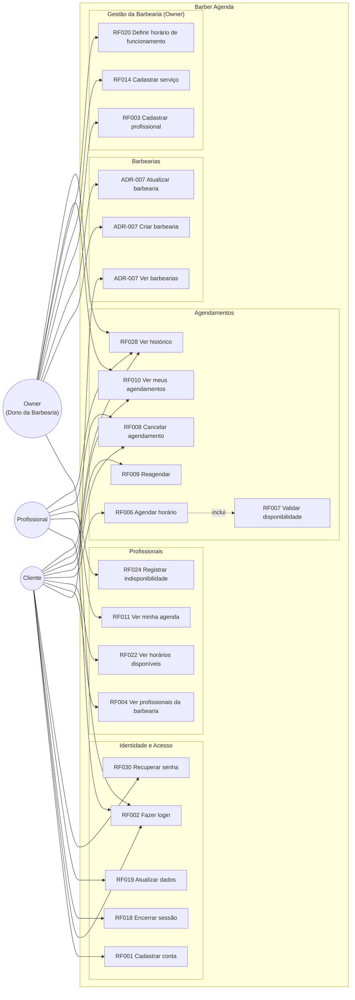

# Diagrama de Casos de Uso

> Atualizado com perfil `owner` (ADR-007). Baseado nos requisitos funcionais RF001–RF030.

## Perfis e Permissões (RF027 + ADR-007)

| Ação | Cliente | Profissional | Owner |
|------|:-------:|:------------:|:-----:|
| Cadastrar conta | ✅ | — | — |
| Fazer login | ✅ | ✅ | ✅ |
| Ver barbearias | ✅ | ✅ | ✅ |
| Criar barbearia | — | — | ✅ |
| Gerenciar barbearia | — | — | ✅ (própria) |
| Agendar horário | ✅ | — | — |
| Cancelar agendamento | ✅ (próprio) | ✅ (próprio) | ✅ (barbearia) |
| Reagendar | ✅ | — | — |
| Ver agendamentos | ✅ (próprios) | ✅ (próprios) | ✅ (barbearia) |
| Ver agenda individual | — | ✅ | — |
| Registrar indisponibilidade | — | ✅ | — |
| Cadastrar profissional | — | — | ✅ (própria) |
| Cadastrar serviço | — | — | ✅ (própria) |
| Definir horário de funcionamento | — | — | ✅ (própria) |
